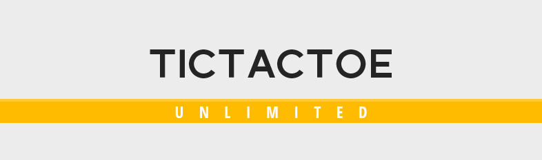

<h1 align="center">TicTacToe Unlimited</h1>

<p align="center">
    A Python Based TicTacToe Game<br><br>
    
</p>


## Game Play

- **Classic Mode**
    - The TicTacToe game we all know and love.
- **Flip Mode**
    - TicTacToe with a flipping twist! It is played on a 4x4 board. At the beginning of each player's turn, they have to *flip* one of their opponents piece to any adjacent blank space to it. The color of the piece changes and it will be treated as a different tile.
    - To win, players must form a line of 3 *unflippable* pieces. Except during *flipping*, when if it forms a line of 3, the player whose piece it is wins the game.


## Features

- **Game Saves**
    - Players have the option to save one of their games, and load it in a latter time. Saving a new game overwrites old saves.
- **In-Game Info Boxes**
    - The game provides helpful information about the game play and the game's features throughout the game.
- **Undo Last Move**
    - Each player, at the end of their turn, has the option to *undo* their moves.


<hr>
<h3 align="center"><a href="screens">View Screenshots</a></h3>
<hr>


## Installation

1. Download the latest version from the GitHub repository.
2. Make sure you have the correct version of Python installed on your machine. This game runs on **Python 3.6 above**.
3. Install the necessary requirements using **pip** by running the command below:

    ```
    pip install requirments.txt
    ```

4. Run the main game script.

    ```
    python main.py
    ```


<h2 align="center">Authors</h2>

<p align="center">
    Conceptualized and Developed by <b>Gerard Balaoro</b>, <b>Carl Kenneth Rico</b>, and <b>Gherome Silvestre</b><br>
    In Partial Fulfillment on the Requirements for the Subject<br>
    Computer Science 11<br>
    1st Semester, A.Y. 2018-2019<br>
    University of the Philippines Diliman
</p>


## Credits

- Interface design based on **["Tic Tac Toe"](https://www.deviantart.com/darksuck/art/Tic-Tac-Toe-PSD-612417028)** by **DarkSuck** on **DeviantArt**
- "Tic Tac Toe" Icon made by **Freepik** from <www.flaticon.com>
- "Info" and "Controls" Icon made by **Roundicons** from <www.flaticon.com>
- "Click" Icon made by **Pixel perfect** <www.flaticon.com>
- "Undo" Icon made by **Kiranshastry** from <www.flaticon.com>