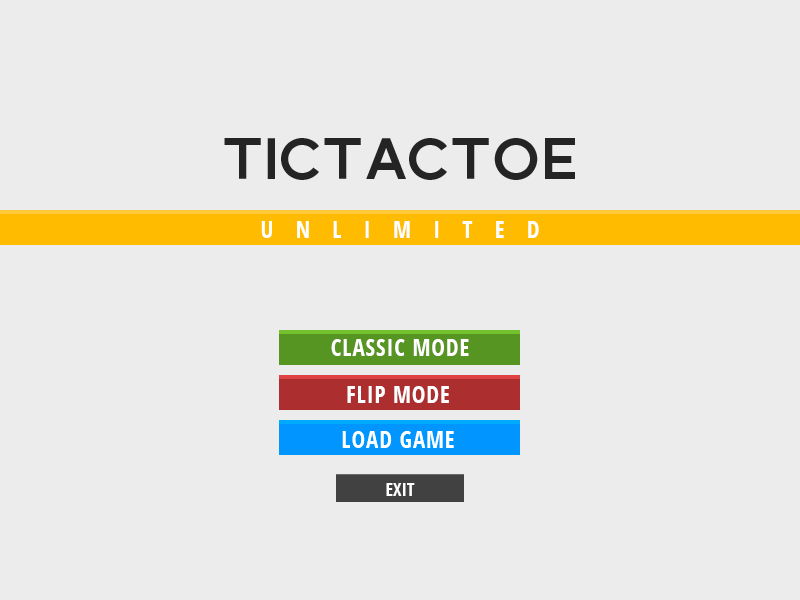
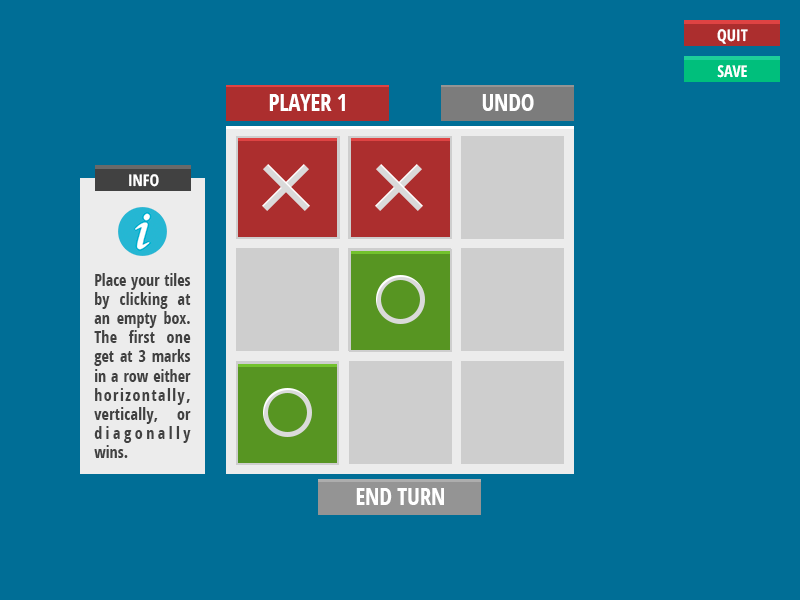
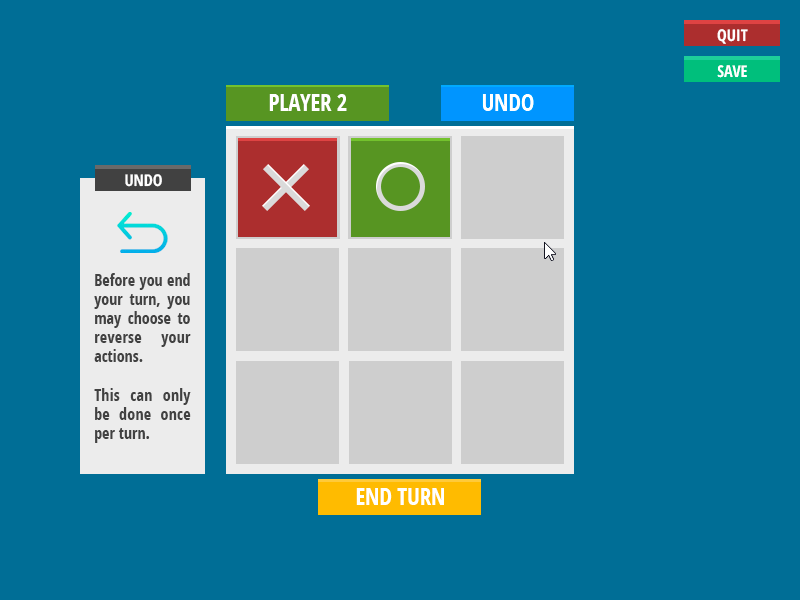
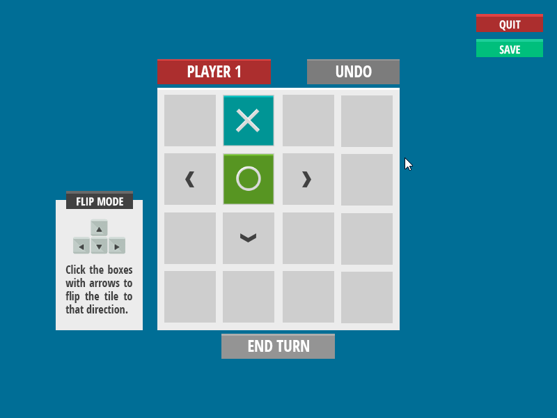
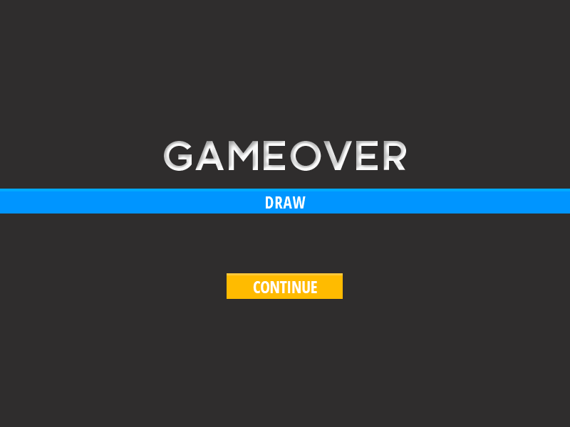

<h1 align="center">TicTacToe Unlimited</h1>

    A Python Based TicTacToe Game

<h2 align="center">Screenshots</h2>

      
      
      
      
    

<h3 align="center"><a href="/index">Go to Homepage</a></h3>

